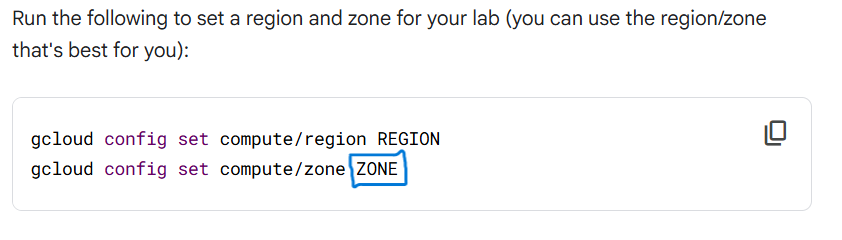

# 🚀 **Cloud Operations for GKE || GSP497**  
[](https://www.cloudskillsboost.google/focuses/5157?parent=catalog) 
---

## ⚠️ **Important Notice**  
This guide is designed to enhance your learning experience during this lab. Please review each step carefully to fully understand the concepts. Ensure you adhere to **Qwiklabs** policies while following this guide.  

---

## 💻 **Execute in Cloud Shell**  
Run the following commands in **Cloud Shell**:  
```bash
curl -LO raw.githubusercontent.com/DarshanKrishna-DK/GoogleArcade/refs/heads/main/Cloud%20Operations%20for%20GKE/GKE.sh

sudo chmod +x GKE.sh

./arcadecrew.sh
```  

Once you execute this code, you will be prompted to enter the zone which you have to copy from the Task 1 section of Lab instruction page. 


NOTE: The zone value will be revealed once you start the lab. Just copy the value which replaces the marked box in the above image. 
Example zone value: us-east4-a


---

## 🎉 **Congratulations! Lab Completed Successfully!** 🏆  

---
 